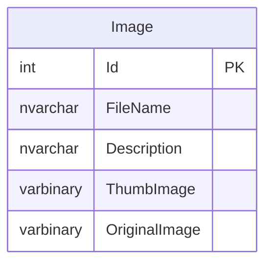

# ImageUploadSample

This is a sample project to demonstrate how to upload images to a SQL Server database using ASP.NET Core.

## Steps

1. Install tools and packages

// dotnet tool install --global dotnet-ef
dotnet tool update --global dotnet-ef
dotnet add package Microsoft.EntityFrameworkCore --version 8.0.11
dotnet add package Microsoft.EntityFrameworkCore.SqlServer --version 8.0.11
dotnet add package Microsoft.EntityFrameworkCore.Design --version 8.0.11
dotnet add package Microsoft.EntityFrameworkCore.Tools --version 8.0.11

2. ConnectionStrings

appsettings.json

  "ConnectionStrings": {
    "DefaultConnection": "Data Source=.\\SQLEXPRESS;Initial Catalog=ImageUploadSample;Integrated Security=True;Encrypt=True;TrustServerCertificate=True"
  },

3. Models and ViewModels

Models/Image.cs, Models/ImagesContext.cs
ViewModels/ImageViewModel.cs

4. Update database

dotnet ef migrations add InitialCreate
dotnet ef database update

5. Controllers

ImagesController.cs

6. Views

Views/Images/Index.cshtml, Views/Images/Upload.cshtml, Views/Images/Edit.cshtml, Views/Images/Delete.cshtml, Views/Images/Originals.cshtml

## ER Diagram

